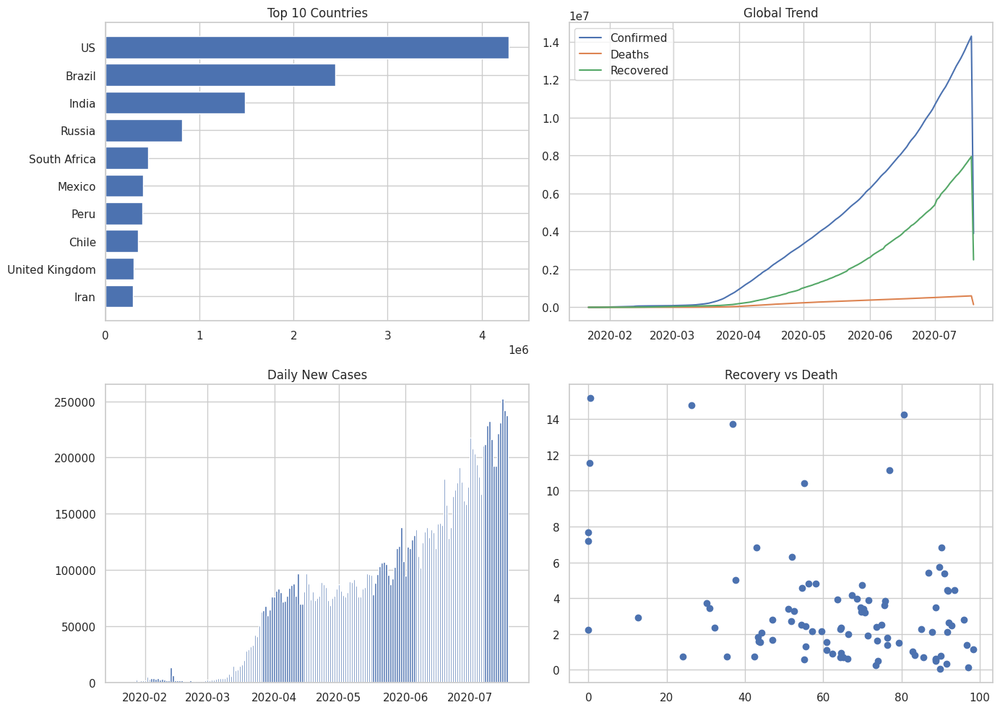

#  COVID-19 Trend Analysis

##  Overview
This project analyzes global COVID-19 data to understand the spread, trends, and overall impact of the pandemic across countries and regions. Using Python and data visualization techniques, it highlights key patterns such as case growth, recovery trends, and mortality rates.

---

##  Objectives
- Understand the global spread of COVID-19  
- Analyze trends over time  
- Compare the impact across countries  
- Evaluate recovery and death rates  
- Present insights through clear visualizations  

---

##  Tools & Technologies
- Python  
- Pandas  
- Matplotlib  

---

##  Analysis Performed
- Top 10 countries by confirmed cases  
- Global trends of confirmed, deaths, and recovered cases  
- Daily new cases analysis  
- Country-wise comparison over time  
- Recovery rate vs death rate analysis  
- Region-wise (WHO) analysis  

---

##  Key Findings
- COVID-19 cases increased rapidly across the globe  
- Death cases grew at a slower rate compared to confirmed cases  
- Recovery trends improved steadily over time  
- Multiple waves of infection were observed through daily case spikes  
- A small number of countries accounted for a large share of total cases  
- Most countries showed high recovery rates and relatively low death rates  
- Some countries experienced higher mortality rates  
- The impact of COVID-19 varied significantly across regions  

---

##  Recommendations
- Strengthen healthcare systems in high-risk regions  
- Monitor data continuously to detect early signs of case spikes  
- Implement timely control measures during peak periods  
- Learn from countries with strong recovery performance  
- Improve healthcare infrastructure and emergency response  
- Promote preventive measures and public awareness  
- Use data-driven approaches for future pandemic preparedness  

---

##  Dashboard

---

## 📊 Visualizations
The project includes:
- Bar charts for country-level comparison  
- Line charts for global trends over time  
- Bar charts for daily new cases  
- Scatter plots for recovery vs death rate analysis  
